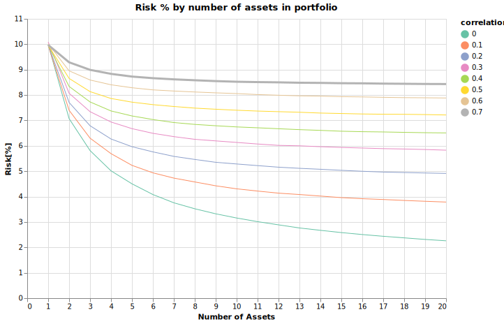

# portfolioRiskReductionViaDiversification

Implementation of the diversification concept detailed in the Coursera MOOC on [trading-strategies-reinforcement-learning](https://www.coursera.org/learn/trading-strategies-reinforcement-learning/lecture/eJtNS/portfolio-risk-reduction).
The original idea comes from Ray Dalio, who referred to it as the Holy Grail of Investing. By increasing diversification, you are able to reduce your overall risk as measured by the standard deviation of portfolio returns. The idea here is to show that if you can create a basket of uncorrelated or low correlation return streams, you can reduce your portfolio risk significantly by increasing the number of streams in your portfolio. 

